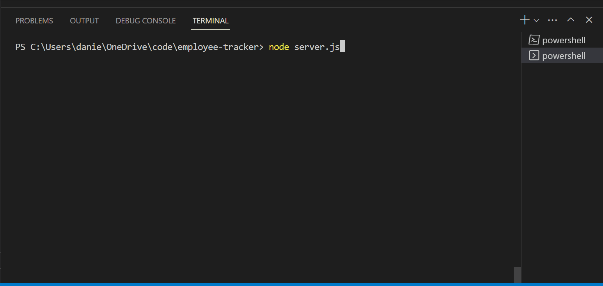

# Employee Tracker
  

  ## Description
  This command-line interface application allows users to manage employees, roles, and departments within a business. The application allows users to view and update employee information, add new employees, departments, and roles, and view summary data on the business. 

  This application was built using Node.js and MySQL. The Inquirer package was used for user input and the MySQL2 package was used for database interactions. Console.table was used to visualize the data within the command-line interface.

  ## Table of Contents
  * [Installation](#installation)
  * [Usage](#usage)
  * [License](#license)
  * [Credits](#credits)

  ## Installation
  To install dependencies, use the command `npm i`.
  
  ## Usage
  To start this application, run `node server.js` in the command line. The user will be prompted with several choices of what they want to do within this database. Select an option and follow the prompts. The user can update the database or view current data. In order to exit, select 'Exit' from the menu or press Ctrl+C.
  

  Walkthough Video: https://drive.google.com/file/d/1zF-m2067cgdcYqTn14OVHw03Ykl7epUD/view

## License

This project is licensed under the [MIT](https://opensource.org/licenses/MIT) license.

## Credits
https://www.npmjs.com/package/mysql2 
https://nodejs.org/api/util.html 
https://developer.mozilla.org/en-US/docs/Web/API/console/table 
https://developer.mozilla.org/en-US/docs/Web/JavaScript/Reference/Global_Objects/Map 
https://www.npmjs.com/package/inquirer
